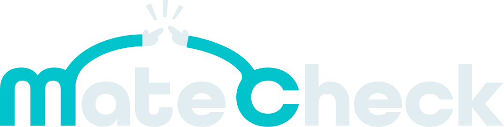
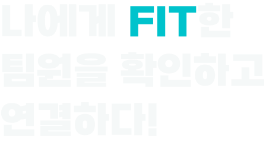
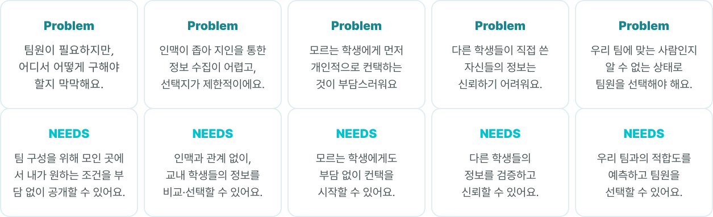
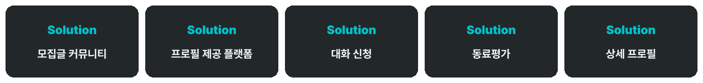
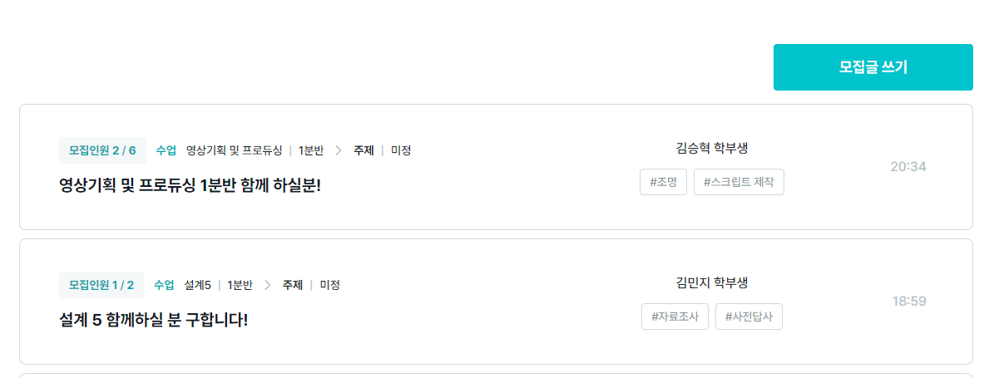
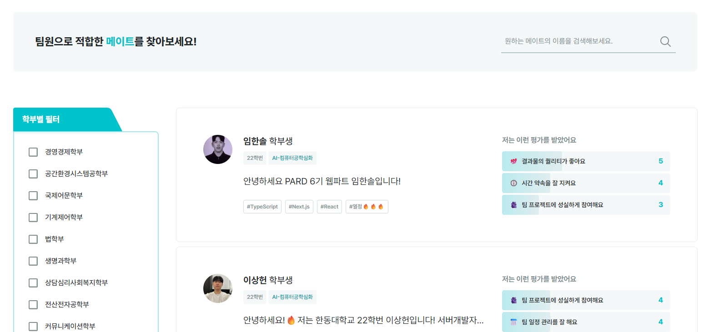
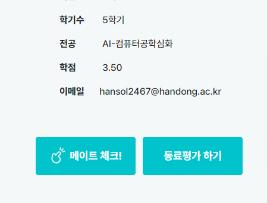
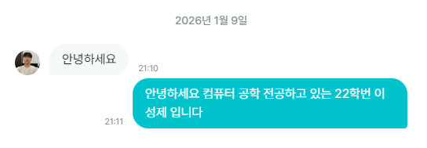
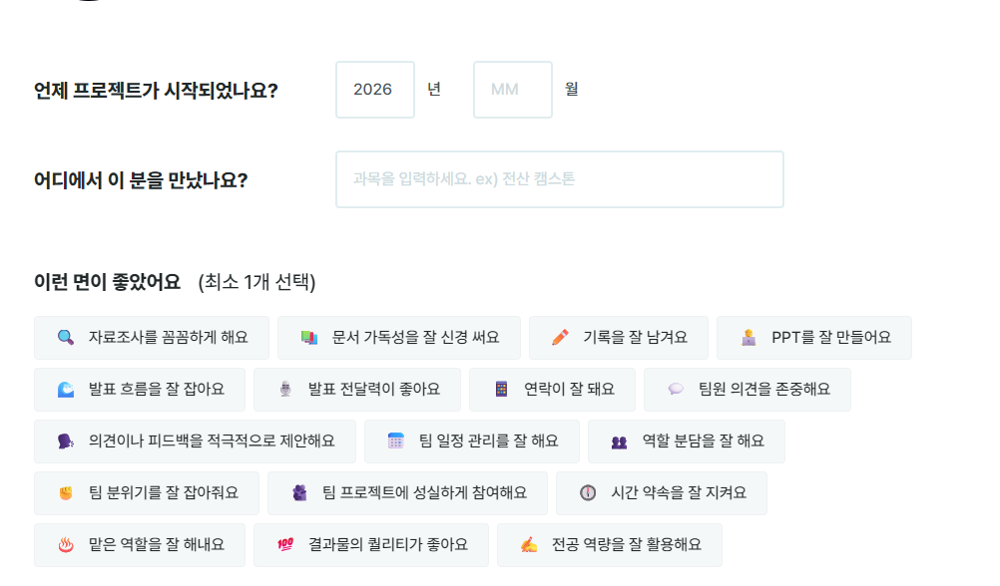

  

  누구와 하느냐가 중요한 대학생의 팀 프로젝트는, 
  다른 팀원들의 정보를 얻기 위해 여전히 인맥에 의존하고 있습니다.  
  <strong>MateCheck</strong>는 이러한 문제를 해결하기 위해 
  학생들의 정보를 투명하게 확인하고, 
  부담 없이 연결될 수 있는 기회를 제공합니다.

---

## 📖 Service Introduction

  

<strong>MateCheck</strong>는 대학생들이 팀 프로젝트, 스터디, 공모전에서  
함께할 메이트를 더 공정하고 쉽게 찾을 수 있도록 돕는 웹 서비스입니다.

🎯 Problem & Solution

## 🚀 Features

### 📝 프로젝트 & 스터디 모집글 작성

팀 프로젝트, 스터디, 공모전 등 목적에 맞는 모집글을 작성할 수 있습니다.  
주제, 전공, 모집 인원, 진행 방식 등을 명확하게 작성하여  
서로의 기대치를 맞춘 상태로 팀원을 모집할 수 있습니다.

  

---

### 👤 학생 프로필 카드

학년, 전공, 관심 분야, 경험 등을 한눈에 확인할 수 있는  
프로필 카드를 제공하여,  
단순한 인맥이 아닌 **정보 기반의 선택**이 가능하도록 돕습니다.

  

---

### 👉 메이트 체크 기능

관심 있는 학생이나 모집글에  
부담 없이 의사를 표현할 수 있는 **메이트 체크 기능**을 제공합니다.

직접적인 연락이 부담스러울 때,  
가볍게 연결의 시작점을 만들 수 있습니다.

  

---

### 💬 실시간 채팅

찌르기를 통해 연결된 사용자끼리는  
플랫폼 내에서 바로 실시간 채팅을 할 수 있습니다.

외부 메신저로 이동하지 않고도  
팀 구성에 필요한 대화를 자연스럽게 이어갈 수 있습니다.

  

---

### 🔍 필터 & 검색

전공, 프로젝트 유형, 학부 등을 기준으로  
모집글과 프로필을 검색하고 필터링할 수 있습니다.

필요한 메이트를 빠르게 찾을 수 있도록  
탐색 과정을 최소화했습니다.

  

---

### 🔍 동료평가

프로젝트를 함께한 이후,
팀원에 대한 <strong>동료평가(피어 리뷰)</strong>를 남길 수 있습니다.

책임감, 협업 태도, 소통 방식 등
실제 협업 경험을 기반으로 한 평가를 통해
다음 팀원들에게 신뢰할 수 있는 참고 정보를 제공합니다.

이를 통해, 단기적인 인상이나 인맥이 아닌 <strong>누적된 협업 기록과 평판</strong>을 바탕으로
더 건강한 팀 문화와 공정한 팀 구성이 이루어질 수 있도록 돕습니다.

  

---

### 🛠 Tech Stack
<strong> 
🎨 Frontend

Next.js (Pages Router) – React 기반 SSR/CSR 웹 애플리케이션

TypeScript – 정적 타입을 통한 안정적인 개발

Tailwind CSS – 빠르고 일관된 UI 스타일링

Zustand – 간결한 전역 상태 관리</strong>